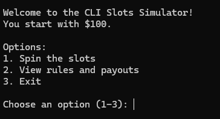
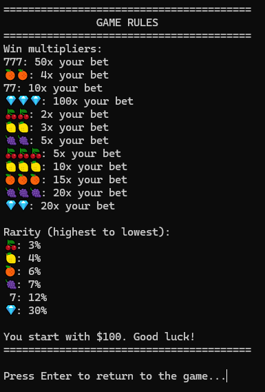
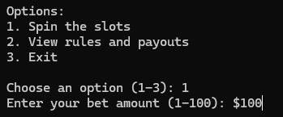
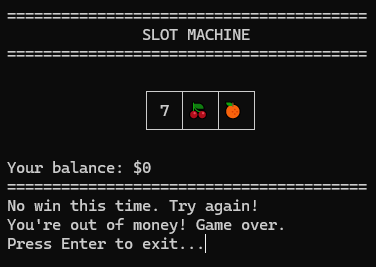

# Info

Game was made just for fun









# Build

```sh
make build
```

# Run

> If you just want to run it, ready build placed in folder builds in source code or you can download it from releases section [here](https://github.com/Slimmerd/burmalda/releases/tag/1.0.0)

- Open a file burmalada.exe from folder builds -> Enjoy
- ./builds/burmalda
